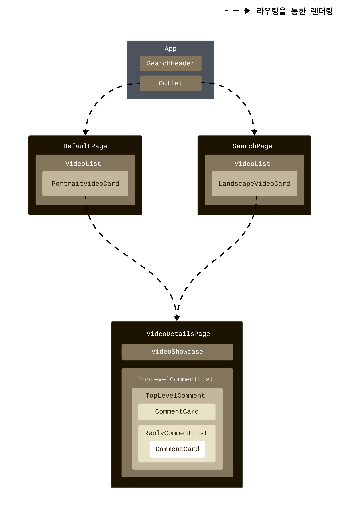

# Youtube Clone

## 개발 동기
본 프로젝트는 YouTube의 핵심 기능들을 모방함으로써, 다양한 API에서 데이터를 효과적으로 수집하고 사용자 인터페이스에 통합하는 데 있어 개인적인 개발 능력을 향상시키려는 의도로 시작됐습니다. 그 과정에서 대규모 애플리케이션들이 데이터를 다양한 엔드포인트에 걸쳐 어떻게 분해하고 구조화하는지에 대한 복잡성을 탐구해보고자 했습니다. 또한, 비동기적으로 데이터를 가져오고 표시하는 다양한 전략을 실험해보며, 데이터 도착에 따른 콘텐츠의 점진적 렌더링이 효율성과 사용자 경험에 미치는 영향을 분석해보고자 했습니다.


## 기술 스택

- React
- JavasScript (ES6+)
- CSS Module

## 재현된 기능들

- **`메인 페이지 트렌딩 비디오`**: 실시간으로 업데이트 되는 인기 동영상들로 메인 홈페이지를 구성했습니다.

- **`검색`**: 키워드 검색을 통해 원하는 비디오를 찾아볼 수 있도록 설계했습니다.

- **`비디오 재생`**: 썸네일 클릭 시, 비디오 감상 페이지로 전환되어 사용자가 영상을 즐길 수 있게 하였습니다.

- **`댓글 및 답글`**: 각 비디오에 관련해 달린 댓글과 답글을 볼 수 있는 섹션을 구축했습니다.

- **`스크롤 기반 콘텐츠 무한 로딩`**: 사용자가 페이지 하단에 도달하면 자동으로 추가 콘텐츠가 자연스럽게 로딩되는 끊김없는 콘텐츠 탐색 경험을 제공합니다.

## 데모 영상

[](https://www.awesomescreenshot.com/video/22508509?key=cec3d003f78b75c083a68587d70afaf3)
**위 미리보기 이미지를 클릭하면 데모 영상으로 이동합니다.** <br>
**이 데모 영상은 스켈레톤 UI나 스피너가 로딩 과정에서 작동되는 걸 시연하기 위해 `느린 3G 환경`에서 녹화되었습니다.**

## 기능 구현에 필요한 API 요약

<table>
  <tr>
    <th>사용 사례</th>
    <th>엔드포인트</th>
    <th>전달해야 하는 쿼리 파라미터</th>
    <th>응답에서 필요한 속성들</th>
    <th>페이지네이션 필요 여부</th>
  </tr>
  <tr>
    <td>검색 쿼리를 기반으로 25개의 동영상 목록 회수</td>
<td><strong>search</strong></td>
    <td>
      <strong>part</strong>: <code>snippet</code><br>
      <strong>type</strong>: video<br>
      <strong>maxResults</strong>: 25<br>
      <strong>q</strong>: {검색 쿼리}<br>
      <br>
      <strong>*nextPageToken</strong>: {nextPageToken} - 다음 페이지 결과 요청 시에만 포함
    </td>
    <td>
      <ul>
        <li>videoId</li>
        <li>snippet:
          <ul>
            <li>channelId</li>
            <li>channelTitle</li>
            <li>title</li>
            <li>description</li>
            <li>thumbnails</li>
            <li>publishedAt</li>
          </ul>
        </li>
        <li>nextPageToken</li>
      </ul>
    </td>
    <td>O</td>

  </tr>
  <tr>
    <td>대한민국 지역에서 가장 인기 있는 25개 동영상 목록 회수</td>
    <td class="url"><strong>videos</strong></td>
    <td>
      <strong>part</strong>: <code>snippet, contentDetails, statistics</code><br>
      <strong>chart</strong>: mostPopular<br>
      <strong>regionCode</strong>: KR<br>
      <strong>maxResults</strong>: 25<br>
      <br>
      <strong>*nextPageToken</strong>: {nextPageToken} - 다음 페이지 결과 요청 시에만 포함
    </td>
    <td>
      <ul>
        <li>id</li>
        <li>snippet:
          <ul>
            <li>channelId</li>
            <li>channelTitle</li>
            <li>title</li>
            <li>description</li>
            <li>thumbnails</li>
            <li>publishedAt</li>
          </ul>
        </li>
        <li>contentDetails:
          <ul>
            <li>duration</li>
          </ul>
        </li>
        <li>statistics:
          <ul>
            <li>viewCount</li>
            <li>likeCount</li>
            <li>commentCount</li>
          </ul>
        </li>
        <li>nextPageToken</li>
      </ul>
    </td>
    <td>O</td>
  </tr>
  <tr>
    <td>동영상 목록 또는 단일 동영상의 상세 정보 회수</td>
    <td class="url"><strong>videos</strong></td>
    <td>
      <strong>part</strong>:
      <ul>
        <li><code>snippet</code>, <code>contentDetails</code>, <code>statistics</code> - 단일 동영상을 위한 상세 정보 회수</li>
        <li><code>contentDetails</code>, <code>statistics</code> - 동영상 목록을 위한 상세 정보 회수; search 엔드포인트에서 반환된 결과를 보충하기 위해 추가적으로 사용됨</li>
      </ul>
        <strong>id</strong>: {비디오 아이디}
    </td>
    <td>
      <ul>
        <li>id</li>
        <li>snippet:
          <ul>
            <li>channelId</li>
            <li>channelTitle</li>
            <li>title</li>
            <li>description</li>
            <li>thumbnails</li>
            <li>publishedAt</li>
          </ul>
        </li>
        <li>contentDetails:
          <ul>
            <li>duration</li>
          </ul>
        </li>
        <li>statistics:
          <ul>
            <li>viewCount</li>
            <li>likeCount</li>
            <li>commentCount</li>
          </ul>
        </li>
      </ul>
    </td>
    <td>X</td>
  </tr>
  <tr>
    <td>채널 목록 또는 단일 채널의 상세 정보 회수</td>
    <td class="url"><strong>channels</strong></td>
    <td>
      <strong>part</strong>: <code>snippet, statistics</code><br>
      <strong>id</strong>: {채널 아이디}
    </td>
    <td>
      <ul>
        <li>id</li>
        <li>snippet:
          <ul>
            <li>thumbnails</li>
          </ul>
        </li>
        <li>statistics:
          <ul>
            <li>subscriberCount</li>
            <li>hiddenSubscriberCount</li>
          </ul>
        </li>
      </ul>
    </td>
    <td>X</td>
  </tr>
  <tr>
    <td> 특정 동영상에 달린 첫 20개 댓글 스레드 회수</td>
    <td class="url"><strong>commentThreads</strong></td>
    <td>
      <strong>part</strong>: <code>snippet, replies</code><br>
      <strong>order</strong>: relevance<br>
      <strong>videoId</strong>: {비디오 아이디}<br>
      <br>
      <strong>*nextPageToken</strong>: {nextPageToken} - 다음 페이지 결과 요청 시에만 포함
      </td>
    <td>
      <ul>
        <li>id</li>
        <li>snippet:
          <ul>
            <li>topLevelComment</li>
            <li>totalReplyCount</li>
          </ul>
        </li>
        <li>replies</li>
        <li>nextPageToken</li>
      </ul>
    </td>
    <td>O</td>
  </tr>
  <tr>
    <td>특정 최상위 댓글에 달린 첫 20개의 응답 댓글 회수</td>
    <td class="url"><strong>comments</strong></td>
    <td>
      <strong>part</strong>: <code>snippet</code><br>
      <strong>parentId</strong>: {최상위 댓글 아이디}<br>
      <br>
      <strong>*nextPageToken</strong>: {nextPageToken} - 다음 페이지 결과 요청 시에만 포함
    </td>
    <td>
      <ul>
        <li>id</li>
        <li>snippet:
          <ul>
            <li>authorDisplayName</li>
            <li>authorProfileImageUrl</li>
            <li>textDisplay</li>
            <li>likeCount</li>
            <li>publishedAt</li>
          </ul>
        </li>
        <li>nextPageToken</li>
      </ul>
    </td>
    <td>O</td>
  </tr>
</table>

## API 구조가 결정한 프로젝트 설계의 주요 지점들

### 워터폴 페칭 방식에서의 UI 렌더링 전략: 점진적 VS 일괄적 접근

검색 결과 페이지(Search Page)는 사용자의 검색 요구를 충족시키기 위해 search 엔드포인트를 사용합니다. 반면, 기본 페이지(Default Page)와 비디오 상세 페이지(Video Details Page)는 각각 인기 동영상 목록과 개별 영상의 상세 정보를 제공하기 위해 videos 엔드포인트를 활용합니다. 그러나 각 엔드포인트가 제공하는 정보만으로는 비디오에 관한 충분한 세부사항을 사용자에게 제공하기 어렵기 때문에, 보다 상세한 정보를 얻기 위해서는 추가 엔드포인트로부터 데이터를 요청해야 합니다.

- **검색 결과 페이지 (Search Page):** <br>
  search 엔드포인트는 비디오의 상세한 정보(재생 시간, 조회수 등)나 채널 썸네일을 제공하지 않기 때문에 videos 및 channels 엔드포인트에 추가 요청이 필요합니다.

- **기본 페이지 (Default Page) & 비디오 상세 페이지 (Video Details Page):** <br>
  videos 엔드포인트는 비디오에 대한 상세 정보를 제공하지만 채널 썸네일과 같은 정보를 포함하고 있지 않기 때문에 channels 엔드포인트에 추가 요청이 필요합니다.

추가 데이터를 위해 다른 엔드포인트들에 요청을 보낼 때는, 기존 엔드포인트가 제공하는 식별자(예: videoId, channelId)를 사용해야 합니다. 이런 의존 관계 때문에, 때때로 여러 엔드포인트에 대한 데이터 요청을 동시에 수행하는 것이 불가능할 수 있으며, 이런 경우에는 요청들이 순차적으로 진행되어야 합니다. 이와 같은 상황은 사용자 인터페이스(UI)에 데이터를 어떻게 표시할지 결정해야 하는 문제로 이어집니다: 각 엔드포인트로부터 데이터가 도착하는 즉시 이를 화면에 표시하여 사용자 인터페이스(UI)를 단계적으로 구축할지, 아니면 모든 데이터 반환이 완료되고 난 후에 한꺼번에 UI를 보여줄지 결정해야 합니다.

브라우저의 네트워크 속도 조절 기능을 활용해 다양한 네트워크 환경에서 실험을 진행한 결과, 데이터를 받는 즉시 UI에 표시하는 방식과 모든 데이터를 기다린 후 일괄적으로 표시하는 방식 사이의 실행 시간 차이는 크지 않았습니다. 따라서 UI를 단계적으로 업데이트하는 것보다는 전체 데이터를 한 번에 받아 표시하는 방식이 더 효과적이라는 결론을 내렸습니다.

### 검색 페이지에서 비디오 상세 페이지로 전환할 때의 데이터 요청 전략

비디오 상세 페이지(Video Details Page)는 두 가지 방법으로 렌더링됩니다. 하나는 검색 페이지(Search Page)나 기본 페이지(Default Page)에서 특정 비디오의 상세 정보를 보기 위해 클릭하는 경우이며, 다른 하나는 URL을 통해 직접 비디오 상세 페이지로 이동하는 경우입니다. 검색 페이지나 기본 페이지에서 비디오 상세 페이지로 이동할 떈, 이미 이전에 요청하여 얻은 비디오 정보를 재사용할 수 있습니다. 그러나 두 페이지가 받아오는 비디오 정보의 "설명" 속성에는 차이가 있습니다. 기본 페이지에서는 주로 videos 엔드포인트를 사용하여 비디오 정보를 가져오며, 이 엔드포인트는 비디오에 대한 "완전한 설명"을 반환합니다. 따라서 상세 페이지에선, 이 정보를 그대로 활용해 설명을 표시할 수 있습니다. 반면에 검색 페이지에서는 주로 search 엔드포인트를 사용하여 비디오 정보를 가져옵니다. 이 엔드포인트는 비디오에 대한 "간략한 설명"만을 반환하며, 이것은 검색 페이지에서는 충분합니다. 그러나 사용자가 비디오 상세 페이지로 이동하면, "완전한 설명"이 필요합니다.

검색 페이지에서 비디오 상세 페이지로 이동할 경우에 완전한 설명을 보여주기 위해 두 가지의 데이터 요청 방법이 있습니다:

1. 검색 페이지는 search 엔드포인트에 데이터 요청 후, videos 엔드포인트에도 어차피 데이터 요청을 하니, 이때 videos 엔드포인트로부터 검색 결과의 모든 비디오의 "완전한 설명"을 반환하도록 한다.
2. 검색 페이지에서 비디오 상세 페이지로 이동했을 경우에 videos 엔드포인트에 클릭된 비디오의 데이터 요청을 함으로 "완전한 설명"을 반환받는다.

두 방법 모두에서 "완전한 설명"을 얻기 위해서는, search 엔드포인트로 이미 받은 데이터('완전한 설명'을 제외한)를 videos 엔드포인트에서 중복적으로 요청해야 합니다. 이는 API의 구조에서 '설명' 속성이 다른 여러 속성들과 함께 하나의 세트로 묶여 있으며, 이 세트를 전체적으로 요청해야만 '완전한 설명' 데이터에 접근할 수 있기 때문입니다.

이 방법의 주요 차이점은 검색 결과에 나타난 25개 비디오 모두의 '완전한 설명'을 미리 요청하는 것과, 사용자가 비디오를 클릭할 때마다 해당 비디오에 대한 '완전한 설명'을 요청하는 것 사이에 있습니다. 본 프로젝트에서는 두 번째 방식을 선택했습니다. 첫 번째 방식은 한 번의 API 요청으로 처리할 수 있다는 장점이 있지만, 사용자가 검색 결과의 모든 비디오를 상세히 볼 가능성이 낮아 네트워크 대역폭을 비효율적으로 사용할 수 있습니다. 반면, 두 번째 방식은 API 요청 횟수가 더 많을 수 있지만, 각 요청의 데이터 페이로드 크기가 상대적으로 작고(첫 번째 방법 대비 약 25분의 1), "완전한 설명"이 실제로 필요한 시점에만 요청되기 때문에 더 효율적이라는 결론을 내렸습니다.

## 컴포넌트 구조도



이 구조도는 본 프로젝트의 주요 컴포넌트와 그들의 계층 관계를 시각적으로 보여줍니다. 각 페이지 컴포넌트(`DefaultPage`, `SearchPage`, `VideoDetailsPage`)는 데이터 페칭과 상태 관리를 담당하는 추상화 레이어로써, 아래의 핵심 기능들을 수행합니다:

- **데이터 페칭(Data Fetching)**: 서버로부터 필요한 데이터를 페칭하고, 이를 자식 컴포넌트에게 props로 전달합니다.
- **상태 관리(State Management)**: 사용자 인터랙션과 데이터 요청에 따른 상태 변화를 관리합니다.
- **무한 스크롤(Infinite Scrolling)**: 사용자가 페이지를 내릴 때 추가 데이터를 로드하는 기능을 구현합니다.

각 페이지 컴포넌트는 다시 세분화된 프레젠테이션 컴포넌트(`VideoList`, `PortraitVideoCard`, `LandscapeVideoCard`, `VideoShowcase` 등)로 구성되어 있어, 실제 사용자 인터페이스를 구성합니다.

## YouTube v3 API 관련 참고 사항

YouTube v3 API의 검색 엔드포인트는 가끔 다음 페이지 검색 결과에 중복된 비디오 검색 결과를 반환하는 문제가 발견되었습니다. 따라서, 이 프로젝트에서는 중복된 결과를 수동으로 걸러내어 고유한 비디오 목록을 제공하지만, 검색 결과를 스크롤하여 추가 로딩할 때마다, 추가로 UI에 보여지는 비디오 수가 항상 25개가 아닐 수 있으니 이 점 유의 바랍니다.

## 시작하기

### 필요 조건

- Node.js가 설치되어 있어야 합니다.
- YouTube Data API 키가 필요하므로 [Google Developers Console](https://console.developers.google.com/)을 통해 키를 생성을 해야합니다.

<br>

### 설치 및 설정

1. **프로젝트 클론**:
   - GitHub에서 본 프로젝트를 클론합니다.
     ```
     git clone https://github.com/sooparkdev/youtube-clone.git
     ```
2. **YouTube API 키 설정**:

   - 프로젝트 루트에 `.env` 파일을 생성한 후, 파일 내에 다음과 같이 YouTube API 키를 추가합니다:
     ```
     REACT_APP_YOUTUBE_API_KEY={발급받은 YouTube API 키}
     ```

3. **의존성 설치**:

   - 프로젝트 폴더로 이동한 후, 필요한 패키지를 설치합니다.
     ```
     npm install
     ```

4. **애플리케이션 실행**:
   - 다음 명령어로 애플리케이션을 시작합니다.
     ```
     npm start
     ```
